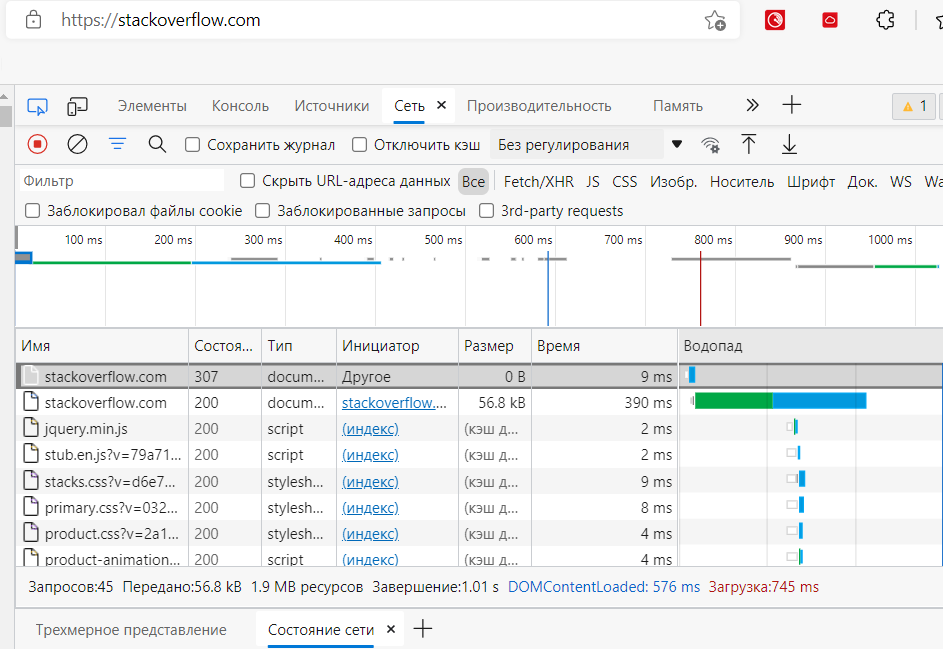

# ДЗ 3.5. Файловые системы
- 1). Работа c HTTP через телнет. В ответе укажите полученный HTTP код, что он означает? 
	
	- __Код 301 означает, что запрос был перенаправлен на ресурс, указанный в заголовке location.__
	```
		root@vagrant:/home/vagrant# telnet stackoverflow.com 80
			Trying 151.101.193.69...
			Connected to stackoverflow.com.
			Escape character is '^]'.
			GET /questions HTTP/1.0
			HOST: stackoverflow.com

			HTTP/1.1 301 Moved Permanently
			cache-control: no-cache, no-store, must-revalidate
			location: https://stackoverflow.com/questions
			x-request-guid: 98f60d5c-1c8d-4d56-ae1d-3ce559eefcdb
			feature-policy: microphone 'none'; speaker 'none'
			content-security-policy: upgrade-insecure-requests; frame-ancestors 'self' https            ://stackexchange.com
			Accept-Ranges: bytes
			Date: Tue, 07 Sep 2021 07:33:37 GMT
			Via: 1.1 varnish
			Connection: close
			X-Served-By: cache-bma1660-BMA
			X-Cache: MISS
			X-Cache-Hits: 0
			X-Timer: S1631000018.521995,VS0,VE101
			Vary: Fastly-SSL
			X-DNS-Prefetch-Control: off
			Set-Cookie: prov=fe29104b-b00a-50ca-3401-d990abcc2351; domain=.stackoverflow.com            ; expires=Fri, 01-Jan-2055 00:00:00 GMT; path=/; HttpOnly

			Connection closed by foreign host.
	```

- 2). Повторите задание 1 в браузере, используя консоль разработчика F12.
	  
	- __Укажите в ответе полученный HTTP код -  307 internal redirect__  
	- __Проверьте время загрузки страницы, какой запрос обрабатывался дольше всего? - запрос ресурса https://stackoverflow.com__  
	
		

- 3). Какой IP адрес у вас в интернете?
		

- 4). Какому провайдеру принадлежит ваш IP адрес? Какой автономной системе AS? Воспользуйтесь утилитой whois

	- __Провайдер ПАО Вымпелком, Автономная система AS16345__ 

	```
		route:          83.220.236.0/23
		descr:          OJSC "VimpelCom"
		origin:         AS16345
		mnt-by:         BEE-MNT
		created:        2013-09-16T16:12:58Z
		last-modified:  2013-09-16T16:12:58Z
		source:         RIPE # Filtered
	```

- 5). Через какие сети проходит пакет, отправленный с вашего компьютера на адрес 8.8.8.8? 
	  Через какие AS? Воспользуйтесь утилитой traceroute
	  
	  - __На выводе traceroute видны hop'ы и автономные системы__
    
	```
		root@vagrant:/home/vagrant# traceroute -An 8.8.8.8
		traceroute to 8.8.8.8 (8.8.8.8), 30 hops max, 60 byte packets
		 1  192.168.43.1 [*]  10.916 ms  10.875 ms  11.455 ms
		 2  * * *
		 3  10.10.144.0 [*]  66.056 ms  66.405 ms  65.514 ms
		 4  10.10.140.17 [*]  58.792 ms  58.370 ms 10.10.140.34 [*]  58.360 ms
		 5  * * *
		 6  10.10.120.1 [*]  65.270 ms * *
		 7  * * *
		 8  * * *
		 9  62.105.150.250 [AS8350/AS3216]  39.824 ms  41.376 ms  41.367 ms
		10  79.104.235.213 [AS3216]  39.795 ms  41.347 ms 79.104.235.215 [AS3216]  41.337 ms
		11  81.211.29.103 [AS3216]  41.326 ms 72.14.205.76 [AS15169]  41.315 ms 72.14.213.116 [AS15169]  42.417 ms
		12  108.170.250.66 [AS15169]  41.212 ms 108.170.250.99 [AS15169]  47.744 ms 108.170.250.146 [AS15169]  48.016 ms
		13  209.85.249.158 [AS15169]  48.850 ms * *
		14  216.239.48.224 [AS15169]  71.501 ms 172.253.65.82 [AS15169]  48.790 ms 216.239.43.20 [AS15169]  48.763 ms
		15  172.253.51.221 [AS15169]  48.749 ms 72.14.237.199 [AS15169]  47.682 ms 216.239.62.9 [AS15169]  51.729 ms
		16  * * *
		17  * * *
		18  * * *
		19  * * *
		20  * * *
		21  * * *
		22  * * *
		23  * * *
		24  * * *
		25  8.8.8.8 [AS15169]  80.048 ms  80.906 ms  80.887 ms
	```

- 6). Повторите задание 5 в утилите mtr. На каком участке наибольшая задержка - delay?

	- __В целом средняя задержка приблизительно равная, наибольшая средняя - hop 13. C наибольшей задержкой в какой-то момент можно отметить hop 9 - WRST 1511 ms__
	```
		vagrant (192.168.43.228)                                    2021-09-07T09:43:01+0000
		Keys:  Help   Display mode   Restart statistics   Order of fields   quit
													Packets               Pings
		 Host                                     Loss%   Snt   Last   Avg  Best  Wrst StDev
		 1. AS???    192.168.43.1                  0.0%   548    5.6   8.1   3.2  52.0   6.9
		 2. (waiting for reply)
		 3. AS???    10.10.144.0                   3.8%   548   35.7  34.4  18.7 106.6  13.4
		 4. AS???    10.10.140.42                  0.0%   548   26.9  31.0  18.1  84.9  10.4
		 5. (waiting for reply)
		 6. AS???    10.10.120.1                   4.6%   548   35.0  34.7  19.4 145.8  13.2
		 7. (waiting for reply)
		 8. AS???    10.10.32.198                  0.4%   548   43.4  34.3  20.1 141.9  12.5
		 9. AS3216   62.105.150.250                0.2%   548   30.5  34.3  18.4 1511.  64.3
		10. AS???    79.104.235.215                0.0%   548   30.7  33.0  19.2 204.2  13.8
		11. AS15169  72.14.213.116                 0.0%   548   40.5  34.0  19.4 180.7  14.6
		12. AS15169  108.170.250.113              16.3%   548   37.2  36.1  19.4 149.4  14.6
		13. AS15169  142.251.49.158               46.7%   548   51.6  48.4  32.2 133.2  13.2
		14. AS15169  216.239.57.222                0.0%   548   40.7  45.9  32.2 142.6  12.2
		15. AS15169  216.239.63.27                 0.0%   548   49.0  47.4  32.8 575.7  26.2
		16. (waiting for reply)
		17. (waiting for reply)
		18. (waiting for reply)
		19. (waiting for reply)
		20. (waiting for reply)
		21. (waiting for reply)
		22. (waiting for reply)
		23. (waiting for reply)
		24. (waiting for reply)
		25. AS15169  8.8.8.8                       0.0%   547   37.2  50.8  32.6 160.4  13.1
	```

- 7). Какие DNS сервера отвечают за доменное имя dns.google? Какие A записи? воспользуйтесь утилитой dig

 	```
		root@vagrant:/home/vagrant# dig +short NS dns.google
		ns4.zdns.google.
		ns2.zdns.google.
		ns1.zdns.google.
		ns3.zdns.google.
		root@vagrant:/home/vagrant# dig +short A dns.google
		8.8.4.4
		8.8.8.8	
	```
 
- 8). Проверьте PTR записи для IP адресов из задания 7. Какое доменное имя привязано к IP? воспользуйтесь утилитой dig 

	- __8.8.4.4 dns.google__
	- __8.8.8.8 dns.google__

 	```
		root@vagrant:/home/vagrant# dig -x 8.8.4.4

		; <<>> DiG 9.16.1-Ubuntu <<>> -x 8.8.4.4
		;; global options: +cmd
		;; Got answer:
		;; ->>HEADER<<- opcode: QUERY, status: NOERROR, id: 36747
		;; flags: qr rd ra; QUERY: 1, ANSWER: 1, AUTHORITY: 0, ADDITIONAL: 1

		;; OPT PSEUDOSECTION:
		; EDNS: version: 0, flags:; udp: 65494
		;; QUESTION SECTION:
		;4.4.8.8.in-addr.arpa.          IN      PTR

		;; ANSWER SECTION:
		4.4.8.8.in-addr.arpa.   7194    IN      PTR     dns.google.

		;; Query time: 0 msec
		;; SERVER: 127.0.0.53#53(127.0.0.53)
		;; WHEN: Tue Sep 07 10:03:45 UTC 2021
		;; MSG SIZE  rcvd: 73


		root@vagrant:/home/vagrant# dig -x 8.8.8.8

		; <<>> DiG 9.16.1-Ubuntu <<>> -x 8.8.8.8
		;; global options: +cmd
		;; Got answer:
		;; ->>HEADER<<- opcode: QUERY, status: NOERROR, id: 46336
		;; flags: qr rd ra; QUERY: 1, ANSWER: 1, AUTHORITY: 0, ADDITIONAL: 1

		;; OPT PSEUDOSECTION:
		; EDNS: version: 0, flags:; udp: 65494
		;; QUESTION SECTION:
		;8.8.8.8.in-addr.arpa.          IN      PTR

		;; ANSWER SECTION:
		8.8.8.8.in-addr.arpa.   50161   IN      PTR     dns.google.

		;; Query time: 48 msec
		;; SERVER: 127.0.0.53#53(127.0.0.53)
		;; WHEN: Tue Sep 07 10:05:04 UTC 2021
		;; MSG SIZE  rcvd: 73

	```