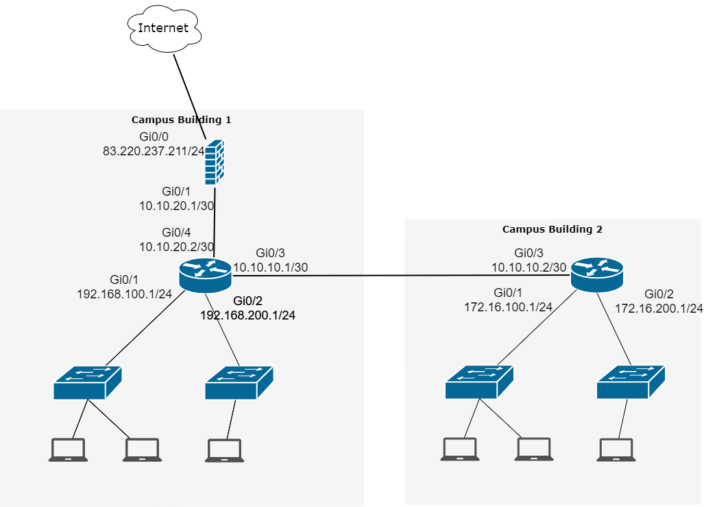

# 3.8. Компьютерные сети, лекция 3
- 1). Подключитесь к публичному маршрутизатору в интернет. 
		Найдите маршрут к вашему публичному IP 
	```
		route-views>show ip route 83.220.237.211
		Routing entry for 83.220.236.0/22
		  Known via "bgp 6447", distance 20, metric 0
		  Tag 6939, type external
		  Last update from 64.71.137.241 2w2d ago
		  Routing Descriptor Blocks:
		  * 64.71.137.241, from 64.71.137.241, 2w2d ago
			  Route metric is 0, traffic share count is 1
			  AS Hops 3
			  Route tag 6939
			  MPLS label: none

		route-views>show bgp 83.220.237.211
		...
		6939 3216 16345, (aggregated by 64703 10.10.100.14)
		  64.71.137.241 from 64.71.137.241 (216.218.252.164)
			Origin IGP, localpref 100, valid, external, atomic-aggregate, best
			path 7FE15D6BF068 RPKI State not found
			rx pathid: 0, tx pathid: 0x0
		...
	```	
	
- 2). Создайте dummy0 интерфейс в Ubuntu. Добавьте несколько статических маршрутов. 
		Проверьте таблицу маршрутизации.
	```
		root@vagrant:/home/vagrant# ip link show
			1: lo: <LOOPBACK,UP,LOWER_UP> mtu 65536 qdisc noqueue state UNKNOWN mode DEFAULT group default qlen 1000
				link/loopback 00:00:00:00:00:00 brd 00:00:00:00:00:00
			2: eth0: <BROADCAST,MULTICAST,UP,LOWER_UP> mtu 1500 qdisc fq_codel state UP mode DEFAULT group default qlen 1000
				link/ether 08:00:27:73:60:cf brd ff:ff:ff:ff:ff:ff
			3: dummy0: <BROADCAST,NOARP> mtu 1500 qdisc noop state DOWN mode DEFAULT group default qlen 1000
				link/ether 56:f8:38:08:d2:96 brd ff:ff:ff:ff:ff:ff
	```	
	```
		root@vagrant:/home/vagrant# ip route
			default via 192.168.43.1 dev eth0 proto dhcp src 192.168.43.228 metric 100
			10.10.10.0/24 via 192.168.43.1 dev eth0
			10.10.20.0/24 via 192.168.43.1 dev eth0 metric 100
			172.10.20.0/24 via 192.168.43.100 dev eth0
			192.168.43.0/24 dev eth0 proto kernel scope link src 192.168.43.228
			192.168.43.1 dev eth0 proto dhcp scope link src 192.168.43.228 metric 100
	```
- 3). Проверьте открытые TCP порты в Ubuntu, какие протоколы и приложения используют эти порты? Приведите несколько примеров.
	
	- __Открытые TCP порты используются протоколом ssh и sunrpc, а также службой DNS__  

	```
		root@vagrant:/home/vagrant# ss -a -t
			State      Recv-Q     Send-Q          Local Address:Port             Peer Address:Port     Process
			LISTEN     0          4096            127.0.0.53%lo:domain                0.0.0.0:*
			LISTEN     0          128                   0.0.0.0:ssh                   0.0.0.0:*
			LISTEN     0          4096                  0.0.0.0:sunrpc                0.0.0.0:*
			ESTAB      0          64             192.168.43.228:ssh            192.168.43.211:65370
			LISTEN     0          128                      [::]:ssh                      [::]:*
			LISTEN     0          4096                     [::]:sunrpc                   [::]:*
	```	
- 4). Проверьте используемые UDP сокеты в Ubuntu, какие протоколы и приложения используют эти порты?

	- __Открытые TCP порты используются протоколом Bootstrap Protocol  и sunrpc, а также службой DNS__ 

	```
		root@vagrant:/home/vagrant# ss -a -u
			State     Recv-Q     Send-Q               Local Address:Port           Peer Address:Port    Process
			UNCONN    0          0                    127.0.0.53%lo:domain              0.0.0.0:*
			UNCONN    0          0              192.168.43.228%eth0:bootpc              0.0.0.0:*
			UNCONN    0          0                          0.0.0.0:sunrpc              0.0.0.0:*
			UNCONN    0          0                             [::]:sunrpc                 [::]:*
	```

- 5). Используя diagrams.net, создайте L3 диаграмму вашей домашней сети или любой другой сети, с которой вы работали.
	    
	

