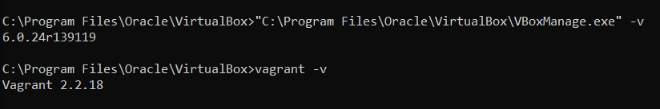
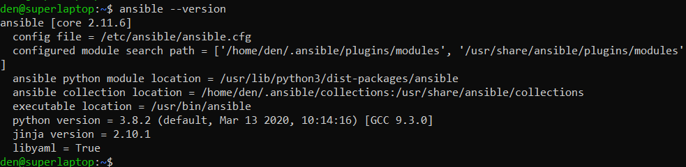
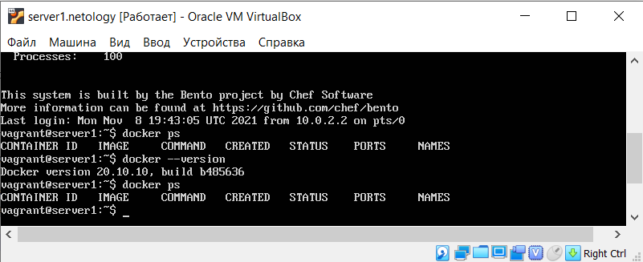

# 5.2. Применение принципов IaaC в работе с виртуальными машинами
- 1). 
	- Опишите своими словами основные преимущества применения на практике IaaC паттернов.
	 
        И системные администраторы и разработчики все работают в одиноковой среде.
        IaaC способствует быстрой доставке продуктов, поддерживает стабильную среду разработки и 
        создает условия для эффективной разработки(отладка кода в песочницах, автоматические тесты)
	
	- Какой из принципов IaaC является основополагающим?  
	
	    Основополагающий принцип - идемпотентность
	
- 2). 

	- Чем Ansible выгодно отличается от других систем управление конфигурациями?
	
	    Нет необходимости в агенте на целевом хосте, достаточно доступа по ssh.
	
	- Какой, на ваш взгляд, метод работы систем конфигурации более надёжный push или pull?
	
        Сложно ответить. Оба метода приемлемы. В любом случае результат работы любого из методов
        мониторится, т.о. в случае неудачи, всегда можно автоматичски 
	
	
- 3). Установить на личный компьютер:

	VirtualBox  
	Vagrant  
	Ansible  
	Приложить вывод команд установленных версий каждой из программ, оформленный в markdown.
	
	
	
	Ansible установлен в Windows Linux subsystem.
	
	
- 4). Воспроизвести практическую часть лекции самостоятельно.

	Создать виртуальную машину.
	Зайти внутрь ВМ, убедиться, что Docker установлен с помощью команды
	docker ps
	
        

