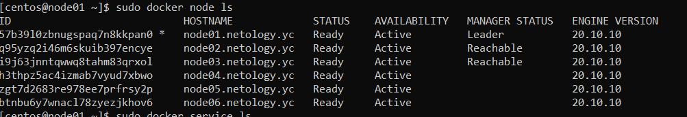
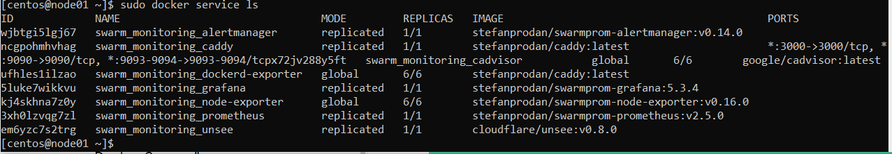

# 5.5. Оркестрация кластером Docker контейнеров на примере Docker Swarm
- 1). 
    В чём отличие режимов работы сервисов в Docker Swarm кластере: replication и global?
    - В режиме replication реплики размещаются только на worker-хостах. 
    В режиме global реплики размещаются и на worker-хостах, и на manager-хостах
    
    Какой алгоритм выбора лидера используется в Docker Swarm кластере?
    - Консенсусный алгоритм RAFT, результат эквивалентен алгоритму PAXOS, но отличается по структуре.
    
    Что такое Overlay Network?
    - Overlay сеть используется в docker swarm для связи контейнеров, расположенных на разных хостах.
	
- 2). Создать ваш первый Docker Swarm кластер в Яндекс.Облаке

    Для получения зачета, вам необходимо предоставить скриншот из терминала (консоли), с выводом команды:

    docker node ls
    
    
	
	
- 3). 

     Создать ваш первый, готовый к боевой эксплуатации кластер мониторинга, состоящий из стека микросервисов.  

     Для получения зачета, вам необходимо предоставить скриншот из терминала (консоли), с выводом команды:  

     docker service ls	
       
	 
    
- 4). 

    Выполнить на лидере Docker Swarm кластера команду (указанную ниже) и дать письменное описание её функционала, что она делает и зачем она нужна:

    # см.документацию: https://docs.docker.com/engine/swarm/swarm_manager_locking/
    docker swarm update --autolock=true
	
  - На работащем кластере swarm эта команда генерирует ключ шифрования, для того, чтобы зашифровать ключ, 
   используемый для шифрования меж-хостового взаимодейcтвия
  и зашифровать ключ, используемый для шифрования логов протокола RAFT на manager-хостах.
    Ключ необходимо вводить для разлокирования(расшифровки ключа TLS  и ключа RAFT протокола) на manager-хостах после рестарта для воссоединения с кластером(rejoin).
    Иначе при работающем Docker-демоне хост в кластере swarm будет помечен как DOWN.