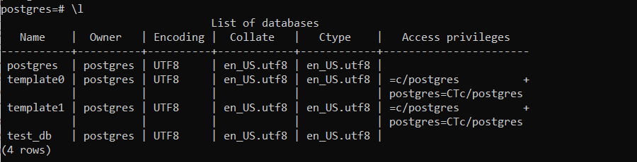
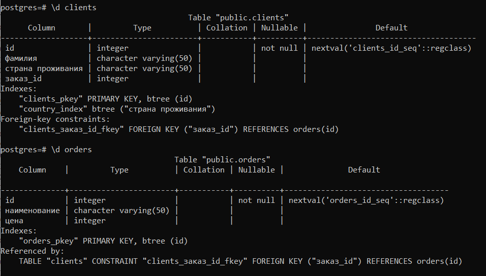
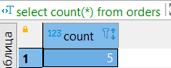
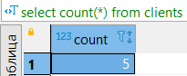
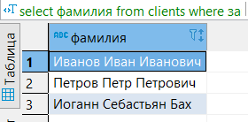
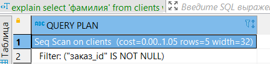

# 6.2. SQL
- 1).
  Используя docker поднимите инстанс PostgreSQL (версию 12) c 2 volume, 
  в который будут складываться данные БД и бэкапы.

  Приведите получившуюся команду или docker-compose манифест.

  ```
     docker run -d ^
      --name PG_NETO2 ^
      -e POSTGRES_PASSWORD=123 ^
      -e PGDATA=/var/lib/postgresql/data/data ^
      -v "e:\netology\devops\docker\6.2\data":/var/lib/postgresql/data ^
      -v "e:\netology\devops\docker\6.2\backup":/opt/backup ^
      -p 5432:5432 ^
      postgres:12
	```


- 2). В БД из задачи 1:

      создайте пользователя test-admin-user и БД test_db
      в БД test_db создайте таблицу orders и clients (спeцификация таблиц ниже)
      предоставьте привилегии на все операции пользователю test-admin-user на таблицы БД test_db
      создайте пользователя test-simple-user
      предоставьте пользователю test-simple-user права на SELECT/INSERT/UPDATE/DELETE данных таблиц БД test_db
      
      Таблица orders:
        id (serial primary key)
        наименование (string)
        цена (integer)
        
      Таблица clients:
        id (serial primary key)
        фамилия (string)
        страна проживания (string, index)
        заказ (foreign key orders)
      
      Приведите:
        итоговый список БД после выполнения пунктов выше,
        описание таблиц (describe)
        SQL-запрос для выдачи списка пользователей с правами над таблицами test_db
        список пользователей с правами над таблицами test_db
    
    
    
    
    
    ```
      SELECT 'clients' as tablename, grantee, privilege_type 
      FROM information_schema.role_table_grants 
      WHERE table_name='clients'
      union
      SELECT 'orders' as tablename, grantee, privilege_type 
      FROM information_schema.role_table_grants 
      WHERE table_name='orders';
	  ```
    
    ```
      |tablename|grantee|privilege_type|
      |---------|-------|--------------|
      |clients|postgres|DELETE|
      |clients|postgres|REFERENCES|
      |orders|postgres|TRIGGER|
      |clients|postgres|TRUNCATE|
      |orders|postgres|SELECT|
      |clients|postgres|TRIGGER|
      |clients|postgres|UPDATE|
      |orders|postgres|INSERT|
      |orders|postgres|DELETE|
      |orders|postgres|REFERENCES|
      |clients|postgres|SELECT|
      |orders|postgres|UPDATE|
      |clients|postgres|INSERT|
      |orders|postgres|TRUNCATE|
      |clients|test-admin-user|TRUNCATE|
      |clients|test-admin-user|SELECT|
      |clients|test-admin-user|INSERT|
      |clients|test-admin-user|UPDATE|
      |orders|test-admin-user|UPDATE|
      |clients|test-admin-user|REFERENCES|
      |clients|test-admin-user|TRIGGER|
      |orders|test-admin-user|INSERT|
      |orders|test-admin-user|SELECT|
      |orders|test-admin-user|DELETE|
      |clients|test-admin-user|DELETE|
      |orders|test-admin-user|REFERENCES|
      |orders|test-admin-user|TRUNCATE|
      |orders|test-admin-user|TRIGGER|
      |clients|test-simple-user|INSERT|
      |orders|test-simple-user|DELETE|
      |orders|test-simple-user|UPDATE|
      |orders|test-simple-user|SELECT|
      |orders|test-simple-user|INSERT|
      |clients|test-simple-user|DELETE|
      |clients|test-simple-user|UPDATE|
      |clients|test-simple-user|SELECT|
	  ```

	
- 3). Используя SQL синтаксис - наполните таблицы следующими тестовыми данными:

        Таблица orders

        Наименование	цена
        Шоколад	10
        Принтер	3000
        Книга	500
        Монитор	7000
        Гитара	4000
        Таблица clients

        ФИО	Страна проживания
        Иванов Иван Иванович	USA
        Петров Петр Петрович	Canada
        Иоганн Себастьян Бах	Japan
        Ронни Джеймс Дио	Russia
        Ritchie Blackmore	Russia
        Используя SQL синтаксис:

        вычислите количество записей для каждой таблицы
        приведите в ответе:
          запросы
          результаты их выполнения. 
          
        - select count(*) from orders;
     
        
        - select count(*) from clients
     
    
- 4).  Часть пользователей из таблицы clients решили оформить заказы из таблицы orders.

      Используя foreign keys свяжите записи из таблиц, согласно таблице:

      ФИО	Заказ
      Иванов Иван Иванович	Книга
      Петров Петр Петрович	Монитор
      Иоганн Себастьян Бах	Гитара
      
      Приведите SQL-запросы для выполнения данных операций.
        
    ```
      update clients as c set
      заказ_id = n.заказ_id
      from (values
        ((select id from clients where фамилия = 'Иванов Иван Иванович'), 
          (select id from orders where наименование = 'Книга')),
        ((select id from clients where фамилия = 'Петров Петр Петрович'), 
          (select id from orders where наименование = 'Монитор')),
        ((select id from clients where фамилия = 'Иоганн Себастьян Бах'), 
          (select id from orders where наименование = 'Гитара'))
      ) as n(id, заказ_id)
      where n.id = c.id;
    ```
      Приведите SQL-запрос для выдачи всех пользователей, которые совершили заказ, а также вывод данного запроса.
      
    ```
      select фамилия
      from clients
      where заказ_id is not null;
    ```
    

      Подсказка - используйте директиву UPDATE.
      
      
- 5). 
    Получите полную информацию по выполнению запроса выдачи всех пользователей из задачи 4 (используя директиву EXPLAIN).

    Приведите получившийся результат и объясните, что значат полученные значения.
    
    
    
    cost - первое число - стоимость запуска, когда появяться первые данные,
            второе число - общая стоимость всего запроса.
            Стоимость условная единица операции чтения страницы с диска.
            
     rows - кол-во обработанных строк
            
     width - выводимый размер строк в байтах
     
     Filter - указывает на условие, по которому фильтруем.

- 6). 
    Создайте бэкап БД test_db и поместите его в volume, предназначенный для бэкапов (см. Задачу 1).

    Остановите контейнер с PostgreSQL (но не удаляйте volumes).

    Поднимите новый пустой контейнер с PostgreSQL.

    Восстановите БД test_db в новом контейнере.

    Приведите список операций, который вы применяли для бэкапа данных и восстановления.
    
    - pg_dumpall -U postgres > /opt/backup/backup.sql

    -
    ```
      docker run -d ^
        --name PG_NETO-BACK ^
        -e POSTGRES_PASSWORD=123 ^
        -e PGDATA=/var/lib/postgresql/data/data ^
        -v "e:\netology\devops\docker\6.2\backup":/opt/backup ^
        -p 5434:5432 ^
        postgres:12
    ```
    - psql -U postgres postgres < /opt/backup/backup.sql
   