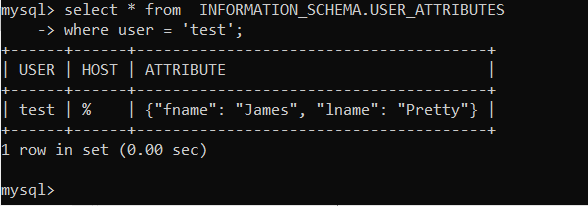

# 6.3. MySQL
- 1).
  - Используя docker поднимите инстанс MySQL (версию 8). Данные БД сохраните в volume.

  ```
     docker run -d ^
      --name PG_NETO_MYSQL ^
      -e MYSQL_ROOT_PASSWORD=123 ^
      -v "e:\netology\devops\docker\6.3\data":/var/lib/mysql ^
      -p 3306:3306 ^
      mysql
	```
  - Изучите бэкап БД и восстановитесь из него.
    mysql -u root -p test_db < test_dump.sql
    
  - Перейдите в управляющую консоль mysql внутри контейнера.
  - Используя команду \h получите список управляющих команд.
  - Найдите команду для выдачи статуса БД и приведите в ответе из ее вывода версию сервера БД.
  
  - Подключитесь к восстановленной БД и получите список таблиц из этой БД
  
  - Приведите в ответе количество записей с price > 300
  
  
- 2). Создайте пользователя test в БД c паролем test-pass, используя:

    плагин авторизации mysql_native_password  
    срок истечения пароля - 180 дней  
    количество попыток авторизации - 3  
    максимальное количество запросов в час - 100  
    аттрибуты пользователя:  
      Фамилия "Pretty"  
      Имя "James"  
      Предоставьте привелегии пользователю test на операции SELECT базы test_db.  
      Используя таблицу INFORMATION_SCHEMA.USER_ATTRIBUTES получите данные по пользователю test и приведите в ответе к задаче.      
      
      
	
- 3). Установите профилирование SET profiling = 1. Изучите вывод профилирования команд SHOW PROFILES;

    Исследуйте, какой engine используется в таблице БД test_db и приведите в ответе.
    
     
     Измените engine и приведите время выполнения и запрос на изменения из профайлера в ответе:
      на MyISAM
      на InnoDB
    
    
- 4).  Изучите файл my.cnf в директории /etc/mysql.

        Измените его согласно ТЗ (движок InnoDB):

        Скорость IO важнее сохранности данных
        Нужна компрессия таблиц для экономии места на диске
        Размер буффера с незакомиченными транзакциями 1 Мб
        Буффер кеширования 30% от ОЗУ
        Размер файла логов операций 100 Мб
        Приведите в ответе измененный файл my.cnf.
        
         