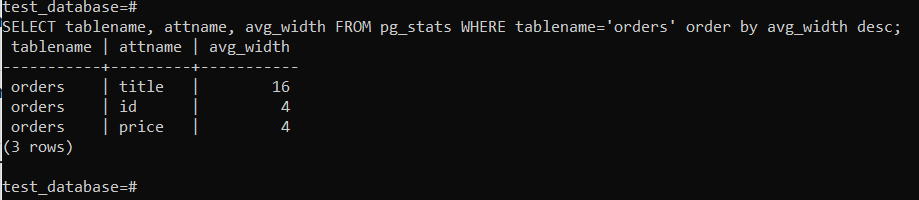
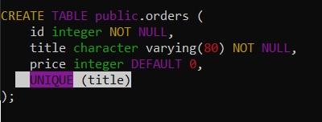

# 6.4. PostgreSQL
- 1).
  Используя docker поднимите инстанс PostgreSQL (версию 13). Данные БД сохраните в volume.
  
  ```
     docker run -d ^
      --name NETO_POSTGRESQL ^
      -e POSTGRES_PASSWORD=123 ^
      -e PGDATA=/var/lib/postgresql/data/data ^
      -v "e:\netology\devops\docker\6.4\data":/var/lib/postgresql/data ^
      -v "e:\netology\devops\docker\6.4\backup":/opt/backup ^
      -p 5436:5432 ^
      postgres:13
  ```

  Подключитесь к БД PostgreSQL используя psql.

  Воспользуйтесь командой \? для вывода подсказки по имеющимся в psql управляющим командам.

  Найдите и приведите управляющие команды для:  

      вывода списка БД  
      - \l    
      подключения к БД  
      - \c  
      вывода списка таблиц  
      - \d  
      вывода описания содержимого таблиц
      - \d tablename  
      выхода из psql  
      - \q


- 2). Используя psql создайте БД test_database.

      Изучите бэкап БД.

      Восстановите бэкап БД в test_database.

      Перейдите в управляющую консоль psql внутри контейнера.

      Подключитесь к восстановленной БД и проведите операцию ANALYZE для сбора статистики по таблице.

      Используя таблицу pg_stats, найдите столбец таблицы orders с наибольшим средним значением размера элементов в байтах.

      Приведите в ответе команду, которую вы использовали для вычисления и полученный результат.
    
    
     
	
- 3). Архитектор и администратор БД выяснили, что ваша таблица orders разрослась до невиданных 
      размеров и поиск по ней занимает долгое время. Вам, как успешному выпускнику курсов DevOps 
      в нетологии предложили провести разбиение таблицы на 2 (шардировать на orders_1 - price>499 
      и orders_2 - price<=499).  
      Предложите SQL-транзакцию для проведения данной операции.  
      
      ```
          -- создание таблиц наследников
          CREATE TABLE orders_2 (CHECK (price <= 499)) INHERITS (orders);
          CREATE TABLE orders_1 (CHECK (price > 499)) INHERITS (orders);
          
          -- создание функции для вставки новых строк в таблицу с шардированием по условию
          CREATE FUNCTION orders_insert_trigger()
          RETURNS TRIGGER AS $$
          BEGIN
              IF ( NEW.price <= 499 ) THEN INSERT INTO orders_2 VALUES (NEW.*);
              ELSIF ( NEW.price > 499 ) THEN INSERT INTO orders_1 VALUES (NEW.*);
              ELSE RAISE EXCEPTION 'Price out of range!';
              END IF;
              RETURN NULL;
          END;
          $$
          LANGUAGE plpgsql;
          
          -- создание триггера для запуска функции вставки
          CREATE TRIGGER insert_orders_trigger
              BEFORE INSERT ON orders
              FOR EACH ROW EXECUTE PROCEDURE orders_insert_trigger();
          
          -- записываем и распределяем(работа триггера) текущие данные из родительской таблицы в таблицы-потомки.
          INSERT INTO orders (title, price)
          SELECT title,price
          from orders;
          
          -- удаляем данные из родительской таблицы
          delete from only orders;
      ```  
        
  Можно ли было изначально исключить "ручное" разбиение при проектировании таблицы orders?
  - Да, можно. Транзакция будет такой же, за исключением последних двух этапов, но созданием родительской таблицы. 
  - Во-вторых, можно использовать упрощенную версию реализации шардирования с помощью PARTITION BY RANGE/LIST.


- 4).  Используя утилиту pg_dump создайте бекап БД test_database.

       Как бы вы доработали бэкап-файл, 
       чтобы добавить уникальность значения столбца title для таблиц test_database?
       
      
