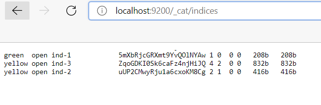

# 6.5. Elasticsearch
- 1).
  В этом задании вы потренируетесь в:

    установке elasticsearch
    первоначальном конфигурировании elastcisearch
    запуске elasticsearch в docker
    Используя докер образ centos:7 как базовый и документацию по установке и запуску Elastcisearch:

    составьте Dockerfile-манифест для elasticsearch
    соберите docker-образ и сделайте push в ваш docker.io репозиторий
    запустите контейнер из получившегося образа и выполните запрос пути / c хост-машины
    Требования к elasticsearch.yml:

    данные path должны сохраняться в /var/lib
    имя ноды должно быть netology_test
    В ответе приведите:

    текст Dockerfile манифеста
    ```
      FROM centos:7

      ENV ES_PATH_CONF=/var/lib/conf
      ENV ES_PATH_WORK=/var/lib/work

      EXPOSE 9200
      EXPOSE 9300

      RUN \
      yum install -y wget perl-Digest-SHA tar && \
      wget https://artifacts.elastic.co/downloads/elasticsearch/elasticsearch-7.15.2-linux-x86_64.tar.gz && \
      wget https://artifacts.elastic.co/downloads/elasticsearch/elasticsearch-7.15.2-linux-x86_64.tar.gz.sha512 && \
      shasum -a 512 -c elasticsearch-7.15.2-linux-x86_64.tar.gz.sha512 && \ 
      tar -xzf elasticsearch-7.15.2-linux-x86_64.tar.gz

      RUN useradd elasticsearch
      RUN chown elasticsearch -R /elasticsearch-7.15.2

      WORKDIR /var/lib
      RUN mkdir data work conf logs
      COPY  ["elasticsearch.yml", "log4j2.properties", "jvm.options", "/var/lib/conf"]
      RUN chown elasticsearch -R /var/lib

      USER elasticsearch
      WORKDIR /elasticsearch-7.15.2/bin 
      ENTRYPOINT ["./elasticsearch","-E","discovery.type=single-node"]
    ```    
    Файл elastcisearch.yml
    ```  
      #elastcisearch.yml
      node.name: netology_test
      path.repo: /elasticsearch-7.15.2/snapshots
      path.data: /var/lib/data
      path.logs: /var/lib/logs
      network.host: 0.0.0.0
      ingest.geoip.downloader.enabled: false
      
    ```  
    ссылку на образ в репозитории dockerhub
    - https://hub.docker.com/r/dennysim/elasticsearch/tags
    
    ответ elasticsearch на запрос пути / в json виде
    ```
      {
        "name" : "netology_test",
        "cluster_name" : "elasticsearch",
        "cluster_uuid" : "4ZTKp6e6RPmBZcXgUQfjLg",
        "version" : {
          "number" : "7.15.2",
          "build_flavor" : "default",
          "build_type" : "tar",
          "build_hash" : "93d5a7f6192e8a1a12e154a2b81bf6fa7309da0c",
          "build_date" : "2021-11-04T14:04:42.515624022Z",
          "build_snapshot" : false,
          "lucene_version" : "8.9.0",
          "minimum_wire_compatibility_version" : "6.8.0",
          "minimum_index_compatibility_version" : "6.0.0-beta1"
        },
        "tagline" : "You Know, for Search"
      }
         
    ```  


- 2). В этом задании вы научитесь:

     создавать и удалять индексы
     изучать состояние кластера
     обосновывать причину деградации доступности данных
     Ознакомтесь с документацией и добавьте в elasticsearch 3 индекса, в соответствии со таблицей:

     Имя	Количество реплик	Количество шард
     ind-1	0	1
     ind-2	1	2
     ind-3	2	4  
     Получите список индексов и их статусов, используя API и приведите в ответе на задание.  
       
     Получите состояние кластера elasticsearch, используя API.  
       

     Как вы думаете, почему часть индексов и кластер находится в состоянии yellow?
     - Не хватает нодов для распределения шардов.
      
     Удалите все индексы.

	
- 3). В данном задании вы научитесь:

     создавать бэкапы данных
     восстанавливать индексы из бэкапов
     Создайте директорию {путь до корневой директории с elasticsearch в образе}/snapshots.

     Используя API зарегистрируйте данную директорию как snapshot repository c именем netology_backup.  

     Приведите в ответе запрос API и результат вызова API для создания репозитория.  
       
     Создайте индекс test с 0 реплик и 1 шардом и приведите в ответе список индексов.  
       
     Создайте snapshot состояния кластера elasticsearch.  

     Приведите в ответе список файлов в директории со snapshotами.  
       
     Удалите индекс test и создайте индекс test-2. Приведите в ответе список индексов.  
       
     Восстановите состояние кластера elasticsearch из snapshot, созданного ранее. 
     Приведите в ответе запрос к API восстановления и итоговый список индексов.
       
     - curl -X POST "localhost:9200/_snapshot/netology_backup/snapshot_1/_restore?pretty"