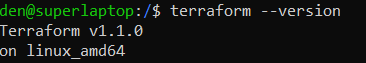
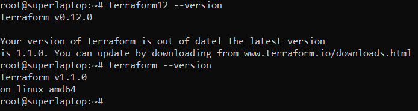

# 7.1. Инфраструктура как код
- 1).
    Легенда  
    
    Через час совещание на котором менеджер расскажет о новом проекте. 
    
    Начать работу над которым надо будет уже сегодня. 
    
    На данный момент известно, что это будет сервис, 
    который ваша компания будет предоставлять внешним заказчикам. 
    
    Первое время, скорее всего, будет один внешний клиент, со временем внешних клиентов станет больше.
    
    Так же по разговорам в компании есть вероятность, 
    что техническое задание еще не четкое, что приведет 
    к большому количеству небольших релизов, тестирований 
    интеграций, откатов, доработок, то есть скучно не будет.

    Вам, как девопс инженеру, будет необходимо принять 
    решение об инструментах для организации инфраструктуры. 
     На данный момент в вашей компании уже используются следующие инструменты:

    остатки Сloud Formation,
    некоторые образы сделаны при помощи Packer,
    год назад начали активно использовать Terraform,
    разработчики привыкли использовать Docker,
    уже есть большая база Kubernetes конфигураций,
    для автоматизации процессов используется Teamcity,
    также есть совсем немного Ansible скриптов,
    и ряд bash скриптов для упрощения рутинных задач.
    
    Для этого в рамках совещания надо будет выяснить подробности о проекте, что бы в итоге определиться с инструментами:

    Какой тип инфраструктуры будем использовать для этого проекта: изменяемый или не изменяемый?
    - Опираясь на нечеткое тз, большое кол-во релизов, доработок и тп. целесообразнее использовать изменяемую инфраструктуру.  
     
    Будет ли центральный сервер для управления инфраструктурой?
    - Будет кластер Kubernetes
    
    Будут ли агенты на серверах?
    - Нет необходимости, тем более на текущий момент системы с агентами в компании не используются.
    
    Будут ли использованы средства для управления конфигурацией или инициализации ресурсов?
    - Эти задачи можно с помощью активно используемоего Terraform, который на текущий момент может 
    также выполнять задачи по настройке. 
      
    В связи с тем, что проект стартует уже сегодня, в рамках совещания надо будет определиться со всеми этими вопросами.
    
    В результате задачи необходимо
    Ответить на четыре вопроса представленных в разделе "Легенда".
    Какие инструменты из уже используемых вы хотели бы использовать для нового проекта?  
    - Глобально можно использовать все из перечисленных технологий.  
    
    Хотите ли рассмотреть возможность внедрения новых инструментов для этого проекта?  
    - В целом достаточно инструментов для проекта. Наверно добавил бы менеджер репозиториев как Nexus Sonatype  
    
    Если для ответа на эти вопросы недостаточно информации, то напишите какие моменты уточните на совещании.
    - Посколько так или иначе любой проект состоит из релизов, доработок, тестирований и т.п.(что не дает специфики по проекту), 
    то уточнить детали можно будет только во время совещания, ближе познакомившись с проектом.

- 2). Официальный сайт: https://www.terraform.io/

    Установите терраформ при помощи менеджера пакетов используемого в вашей операционной системе. 
    В виде результата этой задачи приложите вывод команды terraform --version.  
    
  
	
- 3). В какой-то момент вы обновили терраформ до новой версии, например с 0.12 до 0.13. 
    А код одного из проектов настолько устарел, что не может работать с версией 0.13. 
    В связи с этим необходимо сделать так, чтобы вы могли одновременно использовать 
    последнюю версию терраформа установленную при помощи штатного менеджера пакетов и устаревшую версию 0.12.

    В виде результата этой задачи приложите вывод --version двух версий терраформа 
    доступных на вашем компьютере или виртуальной машине.
    
  
      
