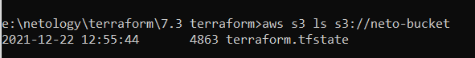
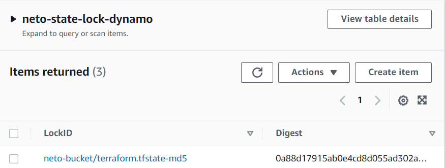
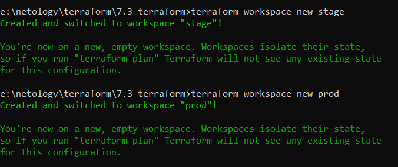
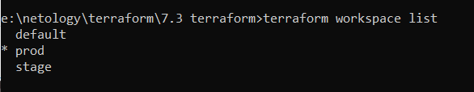

# 7.3. Основы и принцип работы Терраформ
- 1).
  Задача 1. Создадим бэкэнд в S3 (необязательно, но крайне желательно).  
  Если в рамках предыдущего задания у вас уже есть аккаунт AWS, то давайте продолжим знакомство со взаимодействием терраформа и aws.  

  Создайте s3 бакет, iam роль и пользователя от которого будет работать терраформ. 
  Можно создать отдельного пользователя, а можно использовать созданного в рамках предыдущего задания, 
  просто добавьте ему необходимы права, как описано здесь.  
  Зарегистрируйте бэкэнд в терраформ проекте как описано по ссылке выше.
  - 
    ```
      provider "aws" {
        profile = "default"
        region  = "eu-central-1"
      }

      resource "aws_s3_bucket" "tf_course" {
          bucket = "neto-bucket"
          acl = "private"
      }

      resource "aws_dynamodb_table" "dynamodb-neto-state-lock" {
        name = "neto-state-lock-dynamo"
        hash_key = "LockID"
        read_capacity = 20
        write_capacity = 20
       
        attribute {
          name = "LockID"
          type = "S"
        }
      }

      ## uncomment after s3 and dynamodb are initialized, then again "terraform apply"
      #terraform {
      #  backend "s3" {
      #    encrypt = true    
      #    bucket = "neto-bucket"
      #    dynamodb_table = "neto-state-lock-dynamo"
      #    key = "terraform.tfstate"
      #    region = "eu-central-1"
      #  }
      #}
  ```
  - 
  
- 2). 
  Задача 2. Инициализируем проект и создаем воркспейсы.  
  
  1. Выполните terraform init:  
        - если был создан бэкэнд в S3, то терраформ создат файл стейтов в S3 и запись в таблице dynamodb.  
        - иначе будет создан локальный файл со стейтами.  
         
  2. Создайте два воркспейса stage и prod. 
    
  3. В уже созданный aws_instance добавьте зависимость типа инстанса от вокспейса, что бы в разных ворскспейсах использовались разные instance_type.  
  4. Добавим count. Для stage должен создаться один экземпляр ec2, а для prod два.  
  5. Создайте рядом еще один aws_instance, но теперь определите их количество при помощи for_each, а не count.  
  6. Что бы при изменении типа инстанса не возникло ситуации, когда не будет ни одного инстанса добавьте параметр жизненного цикла create_before_destroy = true в один из рессурсов aws_instance.  
  7. При желании поэкспериментируйте с другими параметрами и рессурсами.    
  
  В виде результата работы пришлите:  

  Вывод команды terraform workspace list.
  -   
   
  Вывод команды terraform plan для воркспейса prod.
  - [Terraform plan](./Terraform/7.3/plan.txt)