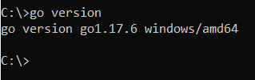
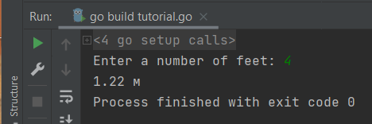
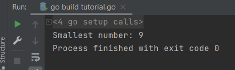
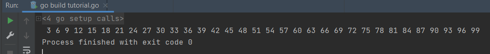

# дз 7.5. Основы golang.
- 1).
  Задача 1. Установите golang.
    Воспользуйтесь инструкций с официального сайта: https://golang.org/.  
    -   
    Так же для тестирования кода можно использовать песочницу: https://play.golang.org/.
  
- 2). 
  Задача 2. Знакомство с gotour.
  У Golang есть обучающая интерактивная консоль https://tour.golang.org/. 
  Рекомендуется изучить максимальное количество примеров. 
  В консоли уже написан необходимый код, осталось только с ним ознакомиться 
  и поэкспериментировать как написано в инструкции в левой части экрана.

  
- 3).
  Задача 3. Написание кода.
  Цель этого задания закрепить знания о базовом синтаксисе языка. 
  Можно использовать редактор кода на своем компьютере, 
  либо использовать песочницу: https://play.golang.org/.

  1) Напишите программу для перевода метров в футы (1 фут = 0.3048 метр). 
  Можно запросить исходные данные у пользователя, а можно статически задать в коде. 
  Для взаимодействия с пользователем можно использовать функцию Scanf:

  ```
  package main  
  import "fmt"  
  func main() {  
    fmt.Print("Enter a number: ")
    var input float64  
      fmt.Scanf("%f", &input)  
      output := input * 2  
      fmt.Println(output)    
  }
  ```  
  - Решение
  ```
      package main
      import "fmt"

      func main() {
        fmt.Print("Enter a number of feet: ")
        var input float64

        fmt.Scanf("%f", &input)
        output := input * 0.3048

        fmt.Printf( "%.2f %s", output, "м")
      }
  ```
  
  
  2) Напишите программу, которая найдет наименьший элемент в любом заданном списке, например:

      x := []int{48,96,86,68,57,82,63,70,37,34,83,27,19,97,9,17,}
  
  - Решение
  ```
    package main

    import "fmt"

    func main() {

      x := []int{48, 96, 86, 68, 57, 82, 63, 70, 37, 34, 83, 27, 19, 97, 9, 17}
      min_number := x[0]

      for i := 1; i <= len(x); i++ {
        if x[i] < min_number {
          min_number = x[i]
        }
      }
      fmt.Print("Smallest number: ", min_number)
    }
  ```
  
  
  3) Напишите программу, которая выводит числа от 1 до 100, которые делятся на 3. То есть (3, 6, 9, …).

      В виде решения ссылку на код или сам код.
  
   - Решение
  ```
    package main

    import "fmt"

    func main() {

      for i := 1; i <= 100; i++ {
        if i % 3 == 0 {
          fmt.Print(" ", i)
        }
      }
    }
  ```
  